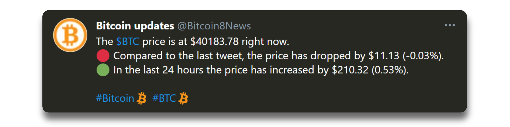
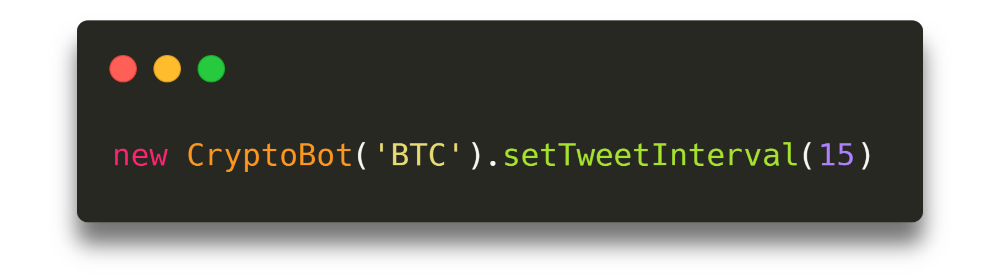
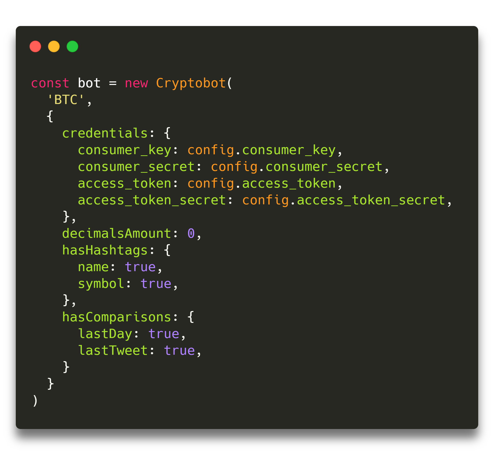
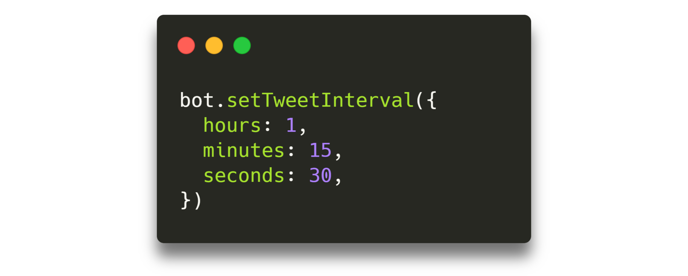

# Twitter Crypto Bot

This bot tweets about the price variations of any cryptocurrency every certain time interval.

> Every coin listed in [Binance](https://www.binance.com) are supported.
>
> Prices' data is retrieved from the [Binance API](https://github.com/binance/binance-spot-api-docs/blob/master/rest-api.md).

Tweets generated by the bot look like this:

You can achieve this with just one line of code! Simply choose a coin, a time interval between tweets, and that's it!

## 📋 Prerequisites

-   [**Node.js**](https://nodejs.org): You need to have Node.js installed on your computer to run this bot. You can download it [here](https://nodejs.org/en/download).

-   [**Twitter account**](https://twitter.com/): This is just a normal Twitter account. You can create one [here](https://twitter.com/i/flow/signup).

-   [**Twitter developer account**](https://developer.twitter.com): Log in with your Twitter account and apply for a developer one [here](https://developer.twitter.com/en/apply-for-access).

## 🎉 Let's start!

-   First of all, go to the [Twitter tokens generator](https://github.com/totigm/twitter-tokens-generator) and generate the necessary access tokens for this bot.
    -   You can skip this step if you already have them.
-   Fork this repository. If you don't know how forking works, check out [this guide](https://guides.github.com/activities/forking)
-   Now that you have your own fork of the project, clone your repository to your computer.
-   Create a file named `.env` at the repo's root directory and paste the keys from the first step in it (It should look like [`.env.example`](.env.example)).
-   Open your console inside the directory.
-   Run `yarn` or `npm i` to install the project's dependencies.
-   Go to the `index.ts` file and choose the cryptocurrency you want, you can also change the time between tweets. Go to the [⚙️ Bot options](#⚙️-bot-options) section to see how to customize your bot.
-   Finally, run `yarn start` or `npm start` and your bot will start running!
-   That's it! You have your own Twitter Crypto Bot!

## ⚙️ Bot options

Your bot can be customized if you want it to have a different behaviour. The options that it supports right now are:

<table>
    <thead>
        <tr>
            <th>Option</th>
            <th>Sub option</th>
            <th>Description</th>
            <th>Default value</th>
            <th>Value type</th>
        </tr>
    </thead>
    <tbody>
        

            <tr>
                <td rowspan="5">
                    <b>credentials</b>
                </td>
            </tr>
            <tr>
                <td>consumer_key</td>
                <td>Key you get from your Twitter app.</td>
                <td>CONSUMER_KEY value in your .env file.</td>
                <td>String</td>
            </tr>
            <tr>
                <td>consumer_secret</td>
                <td>Secret key you get from your Twitter app.</td>
                <td>CONSUMER_SECRET value in your .env file.</td>
                <td>String</td>
            </tr>
            <tr>
                <td>access_token</td>
                <td>Generated access token you get for an specific Twitter user.</td>
                <td>ACCESS_TOKEN value in your .env file.</td>
                <td>String</td>
            </tr>
            <tr>
                <td>access_token_secret</td>
                <td>Generated secret access token you get for an specific Twitter user.</td>
                <td>ACCESS_TOKEN_SECRET value in your .env file.</td>
                <td>String</td>
            </tr>
        

        

            <tr>
                <td><b>decimalsAmount</b></td>
                <td></td>
                <td>
                    Number of decimal places after the comma of the cryptocurrency price.
                </td>
                <td>From 0 to 8 depending on the cryptocurrency price.</td>
                <td>Positive number</td>
            </tr>
        

        

            <tr>
                <td rowspan="3">
                    <b>hasHashtags</b>
                </td>
            </tr>
            <tr>
                <td>symbol</td>
                <td>If the tweet should contain the coin symbol as a hashtag or not. E.g. #BTC.</td>
                <td>true</td>
                <td>Boolean</td>
            </tr>
            <tr>
                <td>name</td>
                <td>
                    If the tweet should contain the coin name as a hashtag or not. E.g. #Bitcoin.
                </td>
                <td>true</td>
                <td>Boolean</td>
            </tr>
        

        

            <tr>
                <td rowspan="3">
                    <b>hasComparisons</b>
                </td>
            </tr>
            <tr>
                <td>lastTweet</td>
                <td>
                    If the tweet should contain the comparison between the current price and the one
                    from 24 hours ago.
                </td>
                <td>true</td>
                <td>Boolean</td>
            </tr>
            <tr>
                <td>lastDay</td>
                <td>
                    If the tweet should contain the comparison between the current price and the one
                    from the last tweet.
                </td>
                <td>true</td>
                <td>Boolean</td>
            </tr>
        

    </tbody>
</table>

When you saw the first example, you might have noticed that the tweet interval was set in minutes. If you want to set the interval to certain amount of hours, minutes, and/or seconds, you can use a time object to explicitly set them.

| Option      | Description                              | Value Type      |
| ----------- | ---------------------------------------- | --------------- |
| **hours**   | Time interval in hours between tweets.   | Positive number |
| **minutes** | Time interval in minutes between tweets. | Positive number |
| **seconds** | Time interval in seconds between tweets. | Positive number |

> As shown in the [first example](#twitter-cryptobot) you can also use just a number instead of an object and it will be considered as minutes.
>
> E.g. `bot.setTweetInterval(15)` is the same as `bot.setTweetInterval({ minutes: 15 })`

## 💖 Support the project

If you like what we do and want to encourage us to continue creating stuff, starring and sharing this project would be really appreciated!

## ✨ Contributing

Contributions are more than welcome!

We think that you might have great ideas to make this project better, so if you do, please create a pull request and/or issue.

## 😃 Authors

-   [Totigm](https://github.com/totigm)
-   [Hernancano98](https://github.com/Hernancano98)

## 📄 License

[MIT](./LICENSE)

This project was made with ❤ and TypeScript
